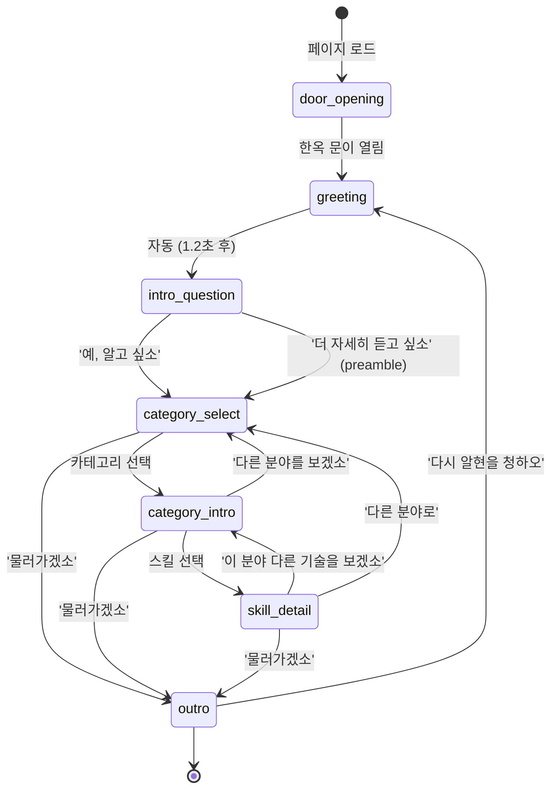

# K-Skill 랜딩 페이지

> 세종대왕 알현 컨셉의 K-스킬 인터랙티브 탐색기

---

## 목차

1. [프로젝트 소개](#1-프로젝트-소개)
2. [주요 기능](#2-주요-기능)
3. [기술 스택](#3-기술-스택)
4. [디자인 토큰 (단청 팔레트)](#4-디자인-토큰-단청-팔레트)
5. [실행 방법](#5-실행-방법)
6. [프로젝트 구조](#6-프로젝트-구조)
7. [새 스킬 추가하기](#7-새-스킬-추가하기-)
8. [새 카테고리 추가하기](#8-새-카테고리-추가하기)
9. [세종대왕 목소리 가이드 (하오체)](#9-세종대왕-목소리-가이드-하오체)
10. [대화 상태 다이어그램](#10-대화-상태-다이어그램)
11. [라이선스 / 출처](#11-라이선스--출처)
12. [기여 가이드](#12-기여-가이드)

---

## 1. 프로젝트 소개

이 프로젝트는 [NomaDamas/k-skill](https://github.com/NomaDamas/k-skill)에서 모은 44개의 K-스킬을 **문명 5(Civilization V)의 세종대왕 알현 장면** 컨셉으로 탐색할 수 있는 인터랙티브 랜딩 페이지입니다. 방문자는 한옥 문을 열고 궁궐 안으로 들어서서 세종대왕을 알현하고, 하오체로 대화하며 원하는 스킬을 찾아갑니다.

경험의 흐름은 이렇습니다. 페이지가 열리면 한옥 대문이 3D 원근감으로 천천히 열립니다. 문이 열리면 궁궐 배경과 세종대왕 캐릭터가 나타나고, 타자기 효과로 대사가 흘러나옵니다. 방문자는 카테고리를 선택하고, 카테고리 안의 스킬 목록을 살펴보고, 개별 스킬의 상세 설명을 읽을 수 있습니다. 모든 대화는 하오체 왕실 어투로 진행됩니다.

챗봇처럼 보이지만 AI를 전혀 사용하지 않습니다. 순수 룰 베이스 상태 머신으로 구현되어 있어, 미리 정의된 대화 흐름을 따라 움직입니다. 덕분에 응답이 빠르고 예측 가능하며, 서버 없이 정적 파일만으로 배포할 수 있습니다.

---

## 2. 주요 기능

- **한옥 문 3D 애니메이션**: CSS `perspective`와 `rotateY`를 조합해 문이 안쪽으로 열리는 입체감을 구현했습니다. 클릭 한 번으로 궁궐 안으로 들어서는 경험을 줍니다.

- **세종대왕 캐릭터**: Civ5 스타일의 SVG 캐릭터로 구현된 세종대왕이 궁궐 배경 앞에 서 있습니다. 한국 문명의 군주답게 단청 컬러와 왕실 의복을 갖추고 있습니다.

- **8개 카테고리, 44개 K-스킬**: 교통/예약, 음식/생활, 쇼핑/가격, 정부/공공, 스포츠/엔터, 문서/검색, 부동산/금융, 기타 — 8개 카테고리에 걸쳐 44개 스킬을 탐색할 수 있습니다.

- **TypeIt 기반 타자기 대화 효과**: TypeIt.js 8을 사용해 세종대왕의 대사가 한 글자씩 타이핑되는 효과를 냅니다. 대사가 끝나면 선택지 버튼이 나타납니다.

- **하오체 royal voice 대사**: 모든 대사는 "그대", "짐", "~하오", "~이오" 같은 왕실 어투로 작성되어 있습니다. 스킬 설명도 예외 없이 하오체로 쓰여 있습니다.

- **글래스 모피즘 + 단청 컬러 팔레트**: 대화창은 반투명 글래스 모피즘 스타일로, 배경의 궁궐 이미지가 은은하게 비칩니다. 단청의 적색, 청색, 녹색, 금색을 디자인 토큰으로 정의해 일관된 색감을 유지합니다.

---

## 3. 기술 스택

| 영역 | 기술 |
|---|---|
| 빌드 | Vite 5 |
| 언어 | Vanilla JavaScript (ES modules) |
| 타자기 | TypeIt.js 8 |
| 폰트 | Nanum Myeongjo (Google Fonts) |
| 테스트 | Playwright (Chromium 헤드리스) |

외부 프레임워크나 UI 라이브러리 없이 순수 Vanilla JS로 작성되어 있습니다. 번들 크기가 작고, 의존성이 단순해 유지보수가 쉽습니다.

---

## 4. 디자인 토큰 (단청 팔레트)

`src/styles/main.css`의 `:root`에 정의된 CSS 변수들입니다. 스타일을 수정할 때 이 토큰을 기준으로 삼으면 전체 색감이 일관되게 유지됩니다.

| 변수명 | 값 | 용도 |
|---|---|---|
| `--palace-red` | `#C60C30` | 단청 적색, 태극 적 |
| `--throne-red` | `#8B0000` | 옥좌 등받이 |
| `--wood-dark` | `#5C4033` | 짙은 목재 |
| `--wood-light` | `#8B4513` | 밝은 목재 |
| `--gold` | `#F4D03F` | 은행잎 황색 |
| `--gold-deep` | `#C9A227` | 깊은 금색 |
| `--dancheong-blue` | `#1E3A8A` | 단청 청색 |
| `--dancheong-green` | `#1B5E20` | 단청 녹색 |
| `--hanji-white` | `#F5F5F5` | 한지 백색 |
| `--hanji-cream` | `#FAF0E6` | 한지 미색 |
| `--shadow-black` | `#1A1A1A` | 그림자 |
| `--ink-black` | `#0d0d0d` | 먹색 배경 |

---

## 5. 실행 방법

```bash
# 의존성 설치
npm install

# Playwright 브라우저 설치 (테스트 시 필요)
npx playwright install chromium

# 개발 서버 실행
npm run dev
# → http://localhost:5173

# 프로덕션 빌드
npm run build

# 빌드 미리보기
npm run preview

# E2E 테스트
npm run test:e2e

# 헤드 모드로 테스트 (브라우저 보면서)
npm run test:e2e:headed

# UI 모드로 테스트
npm run test:e2e:ui
```

Node.js 18 이상을 권장합니다. `npm run dev`를 실행하면 Vite가 개발 서버를 띄우고, `src/data/skills.json`을 포함한 모든 파일 변경을 감지해 브라우저를 자동으로 새로고침합니다.

---

## 6. 프로젝트 구조

```
k-skill-landing-page/
├── index.html
├── package.json
├── vite.config.js
├── playwright.config.js
├── src/
│   ├── main.js                    # 부팅 진입점
│   ├── dialogue-engine.js         # 대화 상태 머신
│   ├── data/
│   │   └── skills.json            # ★ 모든 카테고리/스킬 데이터
│   ├── components/
│   │   ├── Scene.js               # 궁궐 + 세종 SVG
│   │   ├── Door.js                # 한옥 문 애니메이션
│   │   └── DialogueBox.js         # Civ5 스타일 대화창
│   └── styles/
│       ├── main.css               # 디자인 토큰 + @import
│       ├── scene.css              # 궁궐 장면 스타일
│       ├── door.css               # 한옥 문 스타일
│       └── dialogue-box.css       # 대화창 스타일
└── tests/
    └── e2e.spec.js                # Playwright E2E 11개 테스트
```

새 기여자가 가장 먼저 봐야 할 파일은 `src/data/skills.json`입니다. 카테고리와 스킬 데이터가 모두 이 파일 하나에 담겨 있고, 코드를 건드리지 않고도 콘텐츠를 추가하거나 수정할 수 있습니다.

---

## 7. 새 스킬 추가하기 ★

**코드를 수정할 필요가 없습니다.** `src/data/skills.json` 파일만 편집하면 새 스킬이 자동으로 UI에 나타납니다.

### Step 1: `skills` 배열에 새 항목 추가

파일 맨 아래 `"skills"` 배열에 새 객체를 추가합니다. 아래는 '카카오맵 길찾기' 스킬을 추가하는 예시입니다.

```json
{
  "id": "kakao-map-route",
  "name_ko": "카카오맵 길찾기",
  "category": "transport",
  "command": "/kakao-map-route",
  "description_ko": "그대가 길을 잃었다면 짐이 가장 빠른 길을 일러주리라. 출발지와 목적지를 말씀하시면, 카카오맵의 도움을 받아 안내해 드리겠소.",
  "features_ko": [
    "출발지/목적지 입력",
    "최단 경로 계산",
    "대중교통/자가용 옵션"
  ],
  "deprecated": false
}
```

각 필드의 의미는 다음과 같습니다.

| 필드 | 설명 |
|---|---|
| `id` | 고유 식별자. 영문 소문자와 하이픈만 사용. 카테고리의 `skill_ids`와 일치해야 함 |
| `name_ko` | UI에 표시되는 스킬 이름 |
| `category` | 소속 카테고리 ID (아래 목록 참조) |
| `command` | 슬래시 커맨드 형식의 스킬 호출 명령어 |
| `description_ko` | 세종대왕 하오체로 작성된 스킬 설명 (아래 목소리 가이드 참조) |
| `features_ko` | 주요 기능 목록. 짧은 명사구로 작성 |
| `deprecated` | `true`로 설정하면 UI에서 "사용 불가" 표시됨 |

현재 사용 가능한 카테고리 ID 목록입니다.

| 카테고리 ID | 이름 |
|---|---|
| `transport` | 교통/예약 |
| `food-life` | 음식/생활 |
| `shopping` | 쇼핑/가격 |
| `gov-public` | 정부/공공 |
| `sports-ent` | 스포츠/엔터 |
| `docs-search` | 문서/검색 |
| `real-estate-finance` | 부동산/금융 |
| `misc` | 기타 |

### Step 2: 해당 카테고리의 `skill_ids` 배열에 ID 추가

`"categories"` 배열에서 해당 카테고리를 찾아 `skill_ids`에 새 ID를 추가합니다. 교통/예약 카테고리에 추가하는 예시입니다.

```json
{
  "id": "transport",
  "name_ko": "교통/예약",
  "icon": "🚄",
  "sejong_intro": "그대가 이 넓은 조선 땅을 누비고자 한다면 짐이 길을 일러주리라...",
  "skill_ids": [
    "ktx-booking",
    "srt-booking",
    "cheap-gas-nearby",
    "seoul-subway-arrival",
    "subway-lost-property",
    "delivery-tracking",
    "hipass-receipt",
    "kakao-map-route"
  ]
}
```

`skill_ids` 배열의 순서가 UI에서 버튼이 나타나는 순서입니다. 원하는 위치에 ID를 삽입하면 됩니다.

### Step 3: `meta.total_skills` 카운트 갱신 (선택사항)

파일 맨 위의 `meta` 객체에서 카운트를 갱신합니다. 필수는 아니지만 문서 정확성을 위해 맞춰두는 것을 권장합니다.

```json
{
  "meta": {
    "version": "1.0.0",
    "total_skills": 45,
    "total_categories": 8,
    "source_repo": "https://github.com/NomaDamas/k-skill"
  }
}
```

### Step 4: 개발 서버 재시작

Vite는 JSON 파일 변경을 감지해 브라우저를 자동으로 새로고침합니다. 개발 서버가 이미 실행 중이라면 저장만 해도 됩니다. 서버가 꺼져 있다면 다시 시작합니다.

```bash
npm run dev
```

저장 후 브라우저에서 카테고리 선택 화면으로 이동하면, 교통/예약 카테고리 안에 '카카오맵 길찾기' 버튼이 자동으로 나타납니다.

---

## 8. 새 카테고리 추가하기

스킬이 기존 카테고리 어디에도 맞지 않는다면 새 카테고리를 만들 수 있습니다. 마찬가지로 `src/data/skills.json`만 편집하면 됩니다.

### Step 1: `categories` 배열에 새 항목 추가

```json
{
  "id": "education",
  "name_ko": "교육/학습",
  "icon": "📚",
  "sejong_intro": "교육은 백성을 깨우치는 길이오. 훈민정음을 만든 이 왕이 그대의 학문을 도와드리겠소. 어떤 도구가 필요하시오?",
  "skill_ids": [
    "korean-spell-check",
    "korean-character-count"
  ]
}
```

각 필드의 의미입니다.

| 필드 | 설명 |
|---|---|
| `id` | 고유 식별자. 영문 소문자와 하이픈만 사용 |
| `name_ko` | UI에 표시되는 카테고리 이름 |
| `icon` | 카테고리 버튼에 표시되는 이모지 |
| `sejong_intro` | 카테고리 선택 시 세종대왕이 하는 소개 대사. 하오체로 작성 |
| `skill_ids` | 이 카테고리에 속하는 스킬 ID 목록 |

### Step 2: `meta.total_categories` 갱신 (선택)

```json
{
  "meta": {
    "version": "1.0.0",
    "total_skills": 44,
    "total_categories": 9,
    "source_repo": "https://github.com/NomaDamas/k-skill"
  }
}
```

### Step 3: 기존 카테고리에서 옮겨갈 스킬의 `category` 필드 갱신

예를 들어 `korean-spell-check`를 `docs-search`에서 `education`으로 옮긴다면 세 곳을 수정해야 합니다.

**① 스킬의 `category` 필드 변경:**

```json
{
  "id": "korean-spell-check",
  "name_ko": "한국어 맞춤법 검사",
  "category": "education",
  ...
}
```

**② 기존 카테고리(`docs-search`)의 `skill_ids`에서 제거:**

```json
{
  "id": "docs-search",
  "skill_ids": [
    "hwp",
    "geeknews-search",
    "naver-blog-research",
    "joseon-sillok-search",
    "korean-patent-search",
    "korean-character-count"
  ]
}
```

**③ 새 카테고리(`education`)의 `skill_ids`에 추가:**

```json
{
  "id": "education",
  "skill_ids": [
    "korean-spell-check",
    "korean-character-count"
  ]
}
```

세 곳을 모두 수정해야 UI가 올바르게 동작합니다. 하나라도 빠지면 스킬이 두 카테고리에 동시에 나타나거나 아예 보이지 않을 수 있습니다.

---

## 9. 세종대왕 목소리 가이드 (하오체)

`description_ko`와 `sejong_intro`를 작성할 때 반드시 하오체를 사용해야 합니다. 세종대왕의 목소리가 일관되게 유지되어야 경험이 살아납니다.

### 기본 규칙

| 요소 | 사용 |
|---|---|
| 청자 호칭 | "그대" (당신/너 금지) |
| 1인칭 | "짐", "나", "이 왕" |
| 종결어미 | "~하오", "~이오", "~겠소", "~리라", "~노라" |
| 감탄 | "오, 그렇소!", "참으로!" |
| 권고 | "~하시오", "~보시오" |

### 좋은 예시

- "그대가 먼 길을 떠나고자 한다면, 짐이 철마(鐵馬)의 표를 구해 드리리라."
- "한강(漢江)은 도성의 젖줄이오. 그대가 강의 수위가 궁금하다면, 관측소의 기록을 가져다 보여드리겠소."
- "운세가 어떠한지 살펴보고 싶소? 짐이 당첨번호를 일러드리겠소. 천운(天運)이 그대 편이기를 바라오."
- "훈민정음을 창제한 이 왕 앞에서 그대의 글을 바로잡아 드리겠소. 백성이 편히 읽을 수 있는 글로 다듬어 보이리라."

### 나쁜 예시 (피해야 할 표현)

- "이 도구는 ~을 합니다." (평이한 설명문)
- "당신은 ~할 수 있어요." (반말/존댓말 혼용)
- "사용자가 ~한다." (3인칭 설명체)
- "이 기능을 사용하면 ~이 가능합니다." (매뉴얼 문체)

### 한자 병기 팁

고유명사나 지명에 한자를 병기하면 시대감이 살아납니다. 예를 들어 "철마(鐵馬)"는 기차, "도성(都城)"은 서울, "관아(官衙)"는 정부 기관을 뜻합니다. 과하지 않게, 첫 등장 시 한 번만 병기하는 것이 자연스럽습니다.

---

## 10. 대화 상태 다이어그램

대화 흐름은 `src/dialogue-engine.js`의 상태 머신으로 관리됩니다. 아래 다이어그램은 방문자가 경험하는 전체 흐름을 보여줍니다.



각 상태에서 방문자가 선택할 수 있는 버튼은 `dialogue-engine.js`에서 정의합니다. 스킬과 카테고리 데이터는 `skills.json`에서 읽어오므로, JSON만 수정해도 버튼 목록이 자동으로 바뀝니다.

---

## 11. 라이선스 / 출처

- **K-스킬 데이터 출처**: [NomaDamas/k-skill](https://github.com/NomaDamas/k-skill)
- **디자인 영감**: Sid Meier's Civilization V — Korea (Sejong the Great)
- **폰트**: [Nanum Myeongjo](https://fonts.google.com/specimen/Nanum+Myeongjo) (SIL Open Font License)

이 프로젝트는 팬 프로젝트로, Civilization V 또는 2K Games와 공식적인 관계가 없습니다. K-스킬 데이터는 원본 저장소의 라이선스를 따릅니다.

---

## 12. 기여 가이드

기여 방법은 변경하려는 내용에 따라 다릅니다.

| 변경 내용 | 수정 파일 |
|---|---|
| 새 스킬 추가 | `src/data/skills.json` (섹션 7 참조) |
| 새 카테고리 추가 | `src/data/skills.json` (섹션 8 참조) |
| 스킬 설명 수정 | `src/data/skills.json` |
| UI 컴포넌트 변경 | `src/components/` |
| 스타일 토큰 변경 | `src/styles/main.css`의 `:root` |
| 대화 흐름 변경 | `src/dialogue-engine.js` |
| 한옥 문 애니메이션 | `src/components/Door.js`, `src/styles/door.css` |
| 궁궐 배경/캐릭터 | `src/components/Scene.js`, `src/styles/scene.css` |

모든 변경 후에는 반드시 E2E 테스트를 실행해 회귀가 없는지 확인합니다.

```bash
npm run test:e2e
```

테스트가 11개 모두 통과해야 PR을 올릴 수 있습니다. 새 스킬이나 카테고리를 추가했다면 해당 항목이 UI에 올바르게 나타나는지 헤드 모드로 직접 확인하는 것도 좋습니다.

```bash
npm run test:e2e:headed
```

JSON 편집 시 유효성 검사를 먼저 하면 실수를 줄일 수 있습니다. VS Code를 사용한다면 JSON 파일을 열었을 때 자동으로 문법 오류를 표시해 줍니다. 커맨드라인에서 확인하려면 아래 명령을 씁니다.

```bash
node -e "JSON.parse(require('fs').readFileSync('src/data/skills.json', 'utf8')); console.log('JSON 유효')"
```

---

*이 문서는 새 기여자가 코드를 읽지 않고도 스킬과 카테고리를 추가할 수 있도록 작성되었습니다. 궁금한 점이 있다면 이슈를 열어주시오. 짐이 살펴보겠소.*
